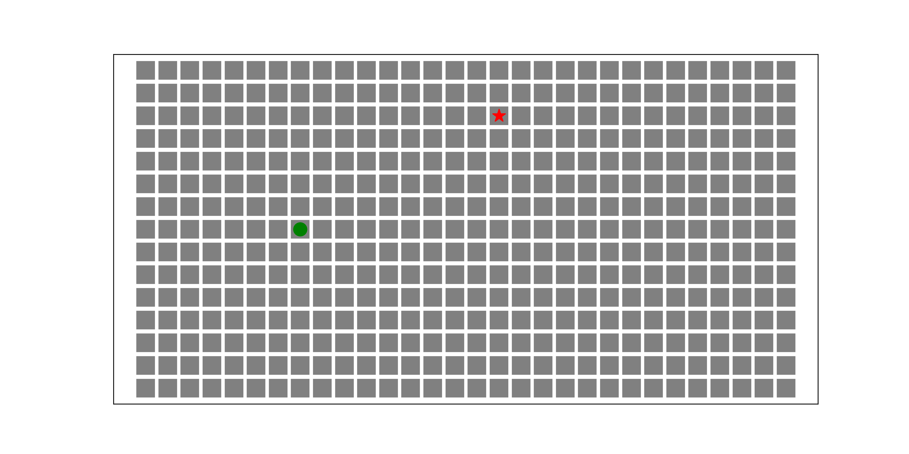

## Implementation and Visualization of Search Algorithms in Grid Maps using Python Networkx

Takeaway techs:

- Breadth-First Search
- Python Visualization
- Python Networkx package


### Breadth-First Search

> Breadth-first search (BFS) is a very commonly used algorithm for graph and tree search. It starts from the tree root (start node in graph)   and explores all nodes at the present depth (neighbour nodes in graph) prior to moving on to the nodes at the next depth level. 
>
> ----*Wikipedia*

This algorithm appears not only in regular path finding, but also in many other types of map analysis. The article from [*Red Blob Games*](https://www.redblobgames.com/pathfinding/a-star/introduction.html#breadth-first-search) gives detailed explanation with impressive animations on how the BFS works in finding shortest path in grid maps. Here we avoid the repetition on the theory, but shows how the algorithm can be used in simple node-to-node path finding algorithm in our entire warehouse project. 

If we leave what behind the algorithm, it simply takes three things as inputs: a graph object (possibly with weights), start node and goal node, and it returns a shortest path and the corresponding cost. Here is the pseudo-code

```python
from SomeLibrary import Graph, BFS
class Graph(Grid2D):
  	class Meta:
      size = (5, 5)

graph = Graph()
start_node = (0, 0)
goal_node = (3, 4)
shortest_path, cost = BFS(graph, start_node, goal_node)
print(shorest_path, cost)
```

In the article from [*Red Blob Games*](https://www.redblobgames.com/pathfinding/a-star/introduction.html#breadth-first-search), the code for path finding in a grid map is given. First you need to down load the library *[implementation.py](https://www.redblobgames.com/pathfinding/a-star/implementation.py)*, then run this code:

```python
from implementation import *

def breadth_first_search(graph: Graph, start: Location, goal: Location):
    frontier = Queue()
    frontier.put(start)
    came_from: Dict[Location, Optional[Location]] = {}
    came_from[start] = None
    
    while not frontier.empty():
        current: Location = frontier.get()
        if current == goal:
            break
        for next in graph.neighbors(current):
            if next not in came_from:
                frontier.put(next)
                came_from[next] = current
    return came_from

g = SquareGrid(30, 15)
g.walls = DIAGRAM1_WALLS

start = (8, 7)
goal = (17, 2)
parents = breadth_first_search(g, start, goal)
draw_grid(g, point_to=parents, start=start, goal=goal)
```

The grid map with obstacles will show in your shell:

```python
__________________________________________________________________________________________
 .  >  >  v  v  v  v  v  v  v  v  v  v  v  v  v  <  .  .  .  . ###### .  .  .  .  .  .  . 
 >  >  >  >  v  v  v  v  v  v  v  v  v  v  v  <  <  <  .  .  . ###### .  .  .  .  .  .  . 
 >  >  >  >  >  v  v  v  v  v  v  v  v  v  <  <  <  Z  .  .  . ###### .  .  .  .  .  .  . 
 >  >  ^ ###### v  v  v  v  v  v  v  v  <  <  <  <  <  <  .  . ###### .  .  .  .  .  .  . 
 .  ^  ^ ###### v  v  v  v  v  v  v  < ###### ^  <  <  .  .  . ###### .  .  .  .  .  .  . 
 .  .  ^ ###### >  v  v  v  v  v  <  < ###### ^  ^  .  .  .  . ############### .  .  .  . 
 .  .  . ###### >  >  v  v  v  <  <  < ###### ^  .  .  .  .  . ############### .  .  .  . 
 .  .  . ###### >  >  >  A  <  <  <  < ###### .  .  .  .  .  .  .  .  .  .  .  .  .  .  . 
 .  .  . ###### >  >  ^  ^  ^  <  <  < ###### .  .  .  .  .  .  .  .  .  .  .  .  .  .  . 
 .  .  v ###### >  ^  ^  ^  ^  ^  <  < ###### .  .  .  .  .  .  .  .  .  .  .  .  .  .  . 
 .  v  v ###### ^  ^  ^  ^  ^  ^  ^  < ###### .  .  .  .  .  .  .  .  .  .  .  .  .  .  . 
 >  >  v ###### ^  ^  ^  ^  ^  ^  ^  ^ ###### .  .  .  .  .  .  .  .  .  .  .  .  .  .  . 
 >  >  >  >  >  ^  ^  ^  ^  ^  ^  ^  ^ ###### .  .  .  .  .  .  .  .  .  .  .  .  .  .  . 
 >  >  >  >  ^  ^  ^  ^  ^  ^  ^  ^  ^ ###### .  .  .  .  .  .  .  .  .  .  .  .  .  .  . 
 .  >  >  ^  ^  ^  ^  ^  ^  ^  ^  ^  ^ ###### .  .  .  .  .  .  .  .  .  .  .  .  .  .  . 
~~~~~~~~~~~~~~~~~~~~~~~~~~~~~~~~~~~~~~~~~~~~~~~~~~~~~~~~~~~~~~~~~~~~~~~~~~~~~~~~~~~~~~~~~~
```

The piece of code basically shows the shortest path from the start point $A$ $(8,7)$ to the goal point $Z$ $(17,2)$.

Lucky, we don't bother to write the `breadth_first_search()` function and draw the grid by ourselves, thanks to the Python package `networkx`. Here we gonna do the same path finding task in the same grid map using NetworkX!

- Install `networkx` via `pip`:
  NetworkX requires Python 3.7, 3.8, or 3.9, check your Python version and make sure it's the supported version:

  ```bash
  $ python --version
  ```

  > NetworkX website: https://networkx.org/documentation/stable/install.html

  Install via `pip`:

  ```shell
  $ pip install networkx
  Collecting networkx
    Downloading networkx-2.6.3-py3-none-any.whl (1.9 MB)
       |████████████████████████████████| 1.9 MB 609 kB/s 
  Installing collected packages: networkx
  Successfully installed networkx-2.6.3
  ```

- Create your first graph instance:

  ```python
  # ./bfs_ntx.py
  import networkx as nx
  
  num_rows = 15
  num_cols = 30
  graph_2d_grid = nx.grid_2d_graph(num_rows, num_cols)
  
  import matplotlib.pyplot as plt
  graph_2d_grid.pos = dict((n,n) for n in graph_2d_grid.nodes())
  nx.draw_networkx(graph_2d_grid, graph_2d_grid.pos, with_labels=True, node_size=1, font_size=5)
  plt.savefig('grid_map.png', dpi=300)
  ```

  Here we have a 2d grid map of size $30\times15$, with unity weight for each edge in the graph.

  

- Mark the start and goal point, find shortest path using NetworkX built-in BFS function:

  ```python
  import networkx as nx
  import matplotlib.pyplot as plt
  
  num_rows = 15
  num_cols = 30
  graph_2d_grid = nx.grid_2d_graph(num_cols, num_rows)
  graph_2d_grid.pos = dict((n,n) for n in graph_2d_grid.nodes())
  
  def y_reversed(map_size, node):
      return node[0], map_size[1]-node[1]
  
  map_size = (num_cols, num_rows)
  start_node = y_reversed(map_size, (8, 7))
  goal_node = y_reversed(map_size, (17, 2))
  
  plt.figure(1, figsize=(12, 6))
  nx.draw_networkx(graph_2d_grid, graph_2d_grid.pos, with_labels=False, node_size=5, font_size=4)
  nx.draw_networkx_nodes(graph_2d_grid,
                         graph_2d_grid.pos,
                         nodelist=[start_node],
                         node_size=55,
                         node_color='green',
                         node_shape="o"
                         )
  nx.draw_networkx_nodes(graph_2d_grid,
                         graph_2d_grid.pos,
                         nodelist=[goal_node],
                         node_size=55,
                         node_color='red',
                         node_shape="*"
                         )
  plt.savefig('start_goal.png', dpi=400)
  ```

  
  
  TBD
  
  ### Dijkstra's Algorithm
  
  So far, in all the grid maps, we assume that each step has the same cost. However, in some problems, for example in the game Civilization, moving through plains take 1 energy point, but moving across forest may take 5 points! Shown in the following figure from [*Red Blob Games*](https://www.redblobgames.com/pathfinding/a-star/introduction.html#breadth-first-search) article, the shortest number of steps does not always associate with the smallest costs.
  
  

> Introduction to the A* Algorithm, by [*Red Blob Games*](https://www.redblobgames.com/pathfinding/a-star/introduction.html#breadth-first-search)

For this uniform cost search problem, the famous Dijkstra's Algorithm can help. Here we 
