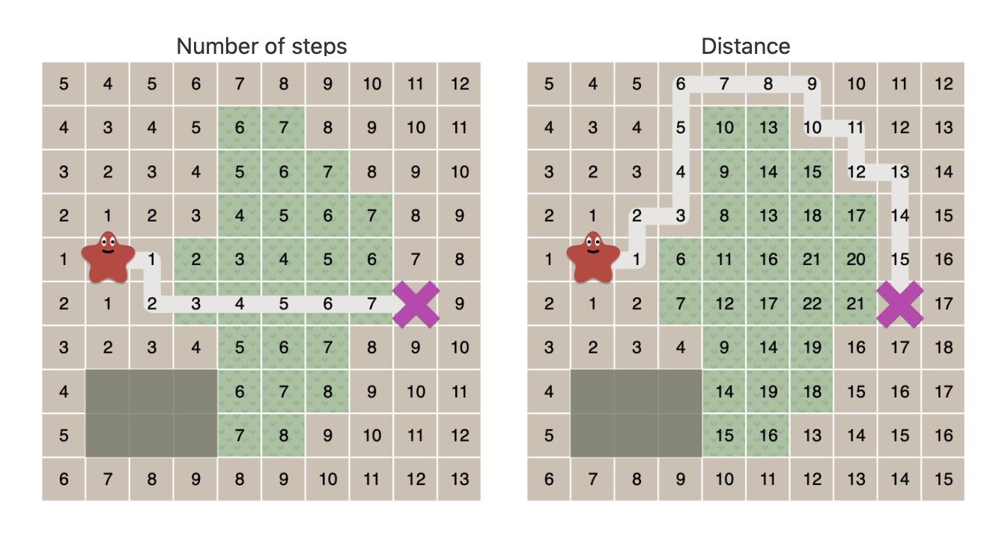
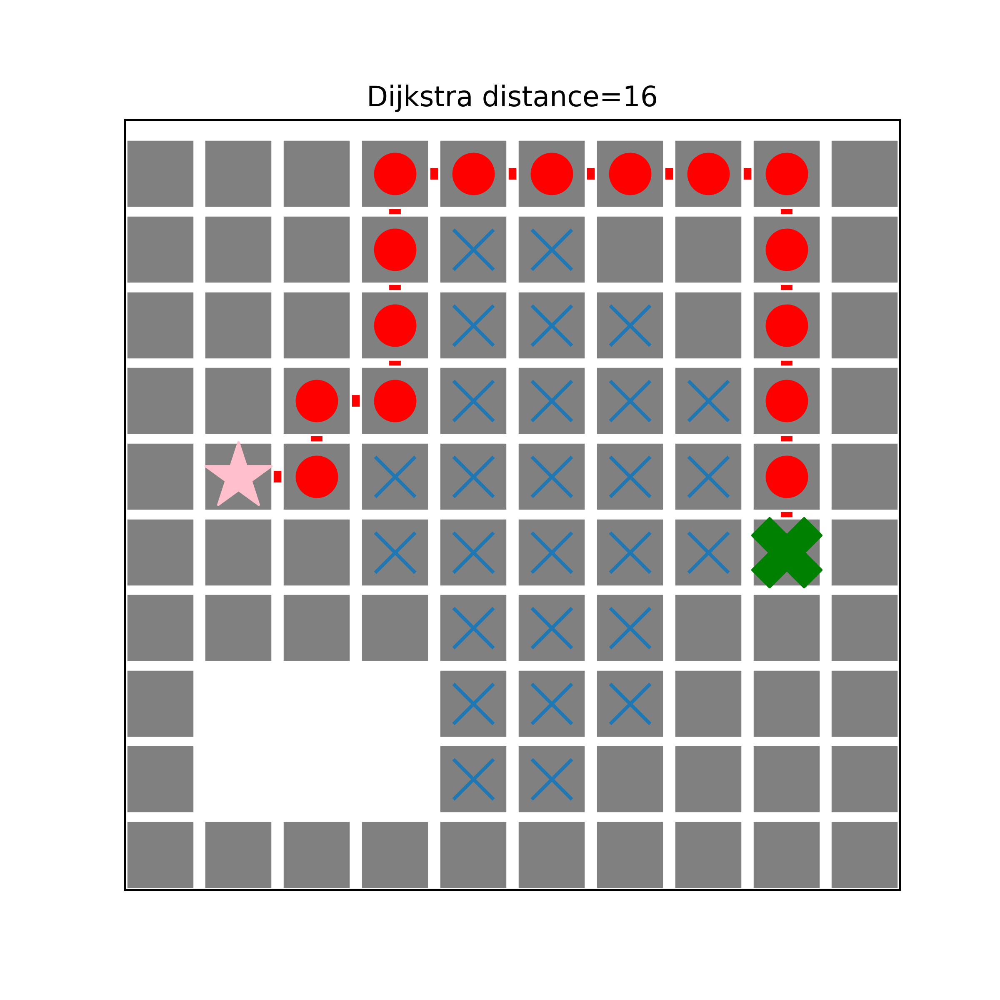

### Dijkstra's Algorithm

So far, in all the grid maps, we assume that each step has the same cost. However, in some problems, for example in the game Civilization, moving through plains take 1 energy point, but moving across forest may take 5 points! Shown in the following figure from [_Red Blob Games_](https://www.redblobgames.com/pathfinding/a-star/introduction.html#breadth-first-search) article, the shortest number of steps does not always associate with the smallest costs.



> Introduction to the A* Algorithm, by [*Red Blob Games\*](https://www.redblobgames.com/pathfinding/a-star/introduction.html#breadth-first-search)

For this uniform cost search problem, the famous Dijkstra's Algorithm can help. Here we use the Dijkstra path finder function of NetworkX to show exact the same solution.

First, we create a $10\times10$ grid map and specify the start and goal node.

```python
import networkx as nx
import matplotlib.pyplot as plt

num_rows = 10
num_cols = 10
graph_2d_grid = nx.grid_2d_graph(num_cols, num_rows)
graph_2d_grid.pos = dict((n,n) for n in graph_2d_grid.nodes())

start_node = (1, 5)
goal_node = (8, 4)
```

Then remove the nodes on bottom-left to create some obstacles that cannot be crossed over.

```python
# obstacles
obstacles = []
for x in range(1, 4):
    for y in range(1, 3):
        nd = (x, y)
        obstacles.append(nd)

# remove obstacle nodes in map
graph_2d_grid.remove_nodes_from(obstacles)
```

Some nodes are supposed more difficult to get through with higher costs (counts 5 moving energy points), which are marked with cross (X).

```python
# update edges of nodes with cost of 5
nodes_with_cost5 = []
for x in range(3, 8):
    if x == 3:
        for y in range(4, 6):
            nd = (x, y)
            nodes_with_cost5.append(nd)
    elif x == 4 or x == 5:
        for y in range(1, 9):
            nd = (x, y)
            nodes_with_cost5.append(nd)
    elif x == 6:
        for y in range(2, 8):
            nd = (x, y)
            nodes_with_cost5.append(nd)
    else:
        for y in range(4, 7):
            nd = (x, y)
            nodes_with_cost5.append(nd)

# change add edge weights to these nodes
for node in graph_2d_grid.nodes:
    if node in nodes_with_cost5:
        for neighbor in graph_2d_grid.neighbors(node):
            graph_2d_grid.add_edge(node, neighbor, weight=5)
```

When the map is prepared, we use the Dijkstra's algorithm to find the shortest path and the corresponding length on considering the cost of each step.

```python
# find shortest path
shortest_path = nx.dijkstra_path(graph_2d_grid,
                                 source=start_node,
                                 target=goal_node,
                                 weight='weight')
dist = nx.dijkstra_path_length(graph_2d_grid,
                               source=start_node,
                               target=goal_node,
                               weight='weight')
```

Then we plot everything on the same figure to compare our results in the above-mentioned article.

```python
edges = []
for i in range(len(shortest_path) - 1):
    current_node = shortest_path[i]
    next_node = shortest_path[i+1]
    edges.append((current_node, next_node))

from copy import deepcopy
# path graph
path_graph = deepcopy(graph_2d_grid)
other_nodes = []
for node in path_graph.nodes:
    if node not in shortest_path[1:-1]:
        other_nodes.append(node)

path_graph.remove_nodes_from(other_nodes)

# plots
plt.figure(1, figsize=(6, 6))
nx.draw_networkx_nodes(graph_2d_grid,
                       graph_2d_grid.pos,
                       node_size=875,
                       node_color='grey',
                       node_shape='s',
                       edgecolors='white')

nx.draw_networkx_nodes(graph_2d_grid,
                       graph_2d_grid.pos,
                       nodelist=nodes_with_cost5,
                       node_shape='x')

nx.draw_networkx_nodes(path_graph,
                       path_graph.pos,
                       node_shape='o',
                       node_color='r')

nx.draw_networkx_edges(path_graph,
                       path_graph.pos,
                       edgelist=edges,
                       edge_color='red',
                       width=5)

nx.draw_networkx_nodes(graph_2d_grid,
                       graph_2d_grid.pos,
                       nodelist=[start_node],
                       node_color='pink',
                       node_shape='*',
                       node_size=890)

nx.draw_networkx_nodes(graph_2d_grid,
                       graph_2d_grid.pos,
                       nodelist=[goal_node],
                       node_color='green',
                       node_shape='X',
                       node_size=890)

plt.title("Dijkstra distance={}".format(dist))
plt.savefig('djikstra.png', dpi=400)
```



Voilà! We get the same results and visualize them!
